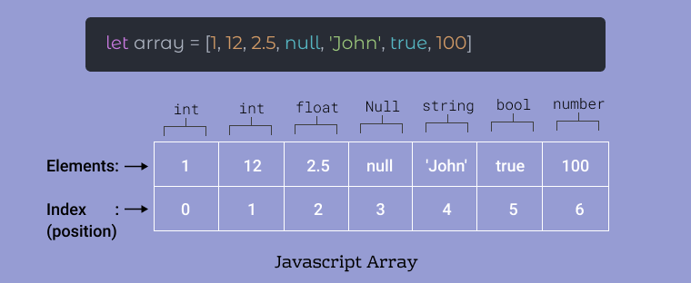
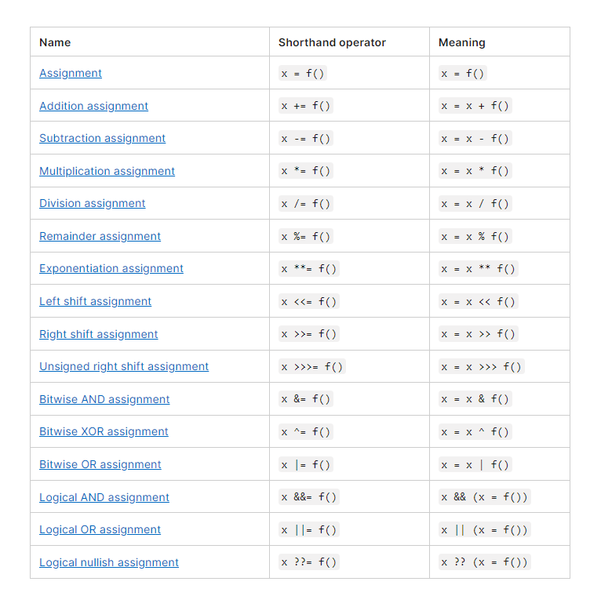
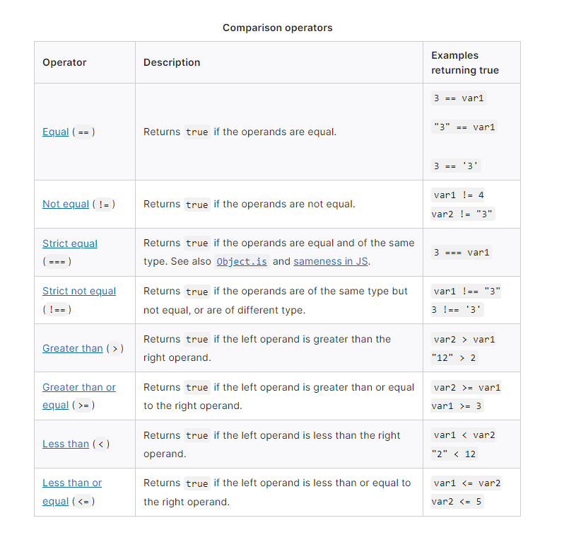

# Class 03 - HTML Lists, CSS Boxes, JS Control Flow

## HTML - Ordered and Unordered Lists

### Ordered and Unordered Lists

    <ol> creates an ordered list.
        Ordered means numbered. Ex. 1. 2. 3. etc
    <ul> creates an unordered list.
        Unordered means bullet points. 
    <li> creates individual list item for each.

Example of Ordered List

    <ol>
    <li>Stuff</li>
    <li>Stuff</li>
    <li>Stuff</li>
    </ol>
    Translates to the below 1 - 3 list.

<ol>
<li>Stuff</li>
<li>Stuff</li>
<li>Stuff</li>
</ol>

Example of Unordered List

    <ul>
    <li>Things</li>
    <li>Things</li>
    <li>Things</li>
    </ul>
    Translates to the below bullet points.

<ul>
<li>Things</li>
<li>Things</li>
<li>Things</li>
</ul>

---

## CSS - The Box Model 

The CSS Box Model is a box that fits around HTML tags. 

This is separated into 3 main parts:

    Margin edge - The outer box. Separates elements outside
    Border edge - 2nd Layer, between margin and padding.  
    Padding edge -Inner box. Sets space between the element inside and the border

See below example of the Box Model:

## JavaScript - Arrays, Operators and Expressions, Conditionals, Loops.

### Arrays

    An array is an object that stores/contains multiple values in a list. 
    Kind of like an <ol> shoopping list.

See below example of an Array:

### Operators and Expressions

An **operator** is a symbol that performs operations on values and variables.

Some types of operators include the following:

- Assignment operators: 
    -  assigns a value to its left operand based on the value of its right operand.
- Comparison operators
    - compares its operands and returns a logical value based on whether the comparison is true. The operands can be numerical, string, logical, or object values.
- Arithmetic operators
    - takes numerical values (either literals or variables) as their operands and returns a single numerical value. The standard arithmetic operators are addition (+), subtraction (-), multiplication (*), and division (/). 
- Bitwise operators
    -  treats their operands as a set of 32 bits (zeros and ones), rather than as decimal, hexadecimal, or octal numbers.
- Logical operators
    - used with Boolean (logical) values; when they are, they return a Boolean value.

## Assignment Operators

## Comparison Operators

---

### Conditionals

Conditional statments includes a hypothesis which is followed by a conclusion.

    if hypothesis is true and conclusion is false,
    then the conditional statement is false

Most common example is the "if else" statement. Example:

    if (condition) {
        // code will run if the condition is true
    } else {
        other code will run if condition isn't true
    }

One could also add in an "else if." 

    if (condition) {
        //code will run if condition is true
    } else if {
        gives an extra choice/outcome for code to run
    } else {
        other code runs i condition isn't true
    }

### Loops

Loops repeat blocks of code.

Types of loops

- "for" loop
- "while" loop
- "do-while" loop

for loop

    for loop repeats code a number of times.
    for (i = 0; i< 10; i++)

while loop

    while loop goes through code as long as a condition is true.
    let i = 0
    while(i > 0) {
        alert ("")
    } else {
        alert("")
    }

do-while loop

    do while loop creates code that executes once, then repeats if condition is true.

    var condition = false;
    do {
        console.log("Run again");
    } while (condition);

## Things I want to know more about

- Loops. These can be pretty confusing for those new to coding.
- Operators. This will come useful when creating loops and variables.
- CSS. My VS Code has had crashing issues when I use write CSS, so I haven't used it much.

[Previous Page](https://tomgtaylor.github.io/reading-notes2/class-02)    ||    [Next Page](https://tomgtaylor.github.io/reading-notes2/class-04)  

---
[HOME](https://tomgtaylor.github.io/reading-notes2)  
