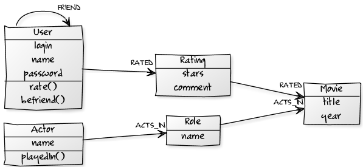

# Class 07 - HTML Tables and JS Constructor Functions

## Domain Modeling

Domain modeling = creates a model in code to address a specific problem.

According to Code Fellows, Domain Modelling:

> "describes the various entities, their attributes and behaviors, as well as the constraints that govern the problem domain. An entity that stores data in properties and encapsulates behaviors in methods is commonly referred to as an object-oriented model.  A domain model that's articulated well can verify and validate the understanding of a specific problem among various stakeholders. As a communication tool, it defines a vocabulary that can be used within and between both technical and business teams."

--- 
Example of domain modeling below:

---

### Defining a constructor + intitialize properties

One needs to use a constructor function to summarize JS representation of the object one is working with.

    Property        Data            Type
    theRating       1 to 10        Number
    hasAction     true or false    Boolean

### Generate Random Numbers

    JS library uses Math.random()

### Calculate daily likes

    If meausured in Likes, 

## HTML Table Basics

## Introducing Constructors

## Object Prototypes Using a Constructor

---

## Things I want to know more about

- More about how to use Dom properly.
- Practical usage of objects for web pages / apps.

[Previous Page](https://tomgtaylor.github.io/reading-notes2/class-06)    ||    [Next Page](https://tomgtaylor.github.io/reading-notes2/class-08)  

---
[HOME](https://tomgtaylor.github.io/reading-notes2)  
